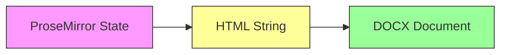
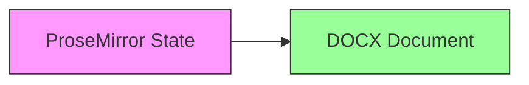

# ProseMirror to DOCX Export Implementation Plan

## Overview

This document outlines two approaches for implementing DOCX export in our Umo Editor:

1. **Current Approach**: ProseMirror → HTML → DOCX
2. **Direct Approach**: ProseMirror → DOCX

## Feature Comparison

### Features We Already Have

#### Text Formatting
- Bold, italic, underline ✓ (via StarterKit and extensions)
- Font family ✓ (via FontFamily extension)
- Font size ✓ (via FontSize extension)
- Text color ✓ (via Color extension)
- Superscript and subscript ✓ (via extensions)
- Text highlight ✓ (via Highlight extension)
- Strike-through ✓ (via StarterKit)

#### Paragraph Formatting
- Alignment ✓ (via TextAlign extension)
- Line spacing ✓ (via LineHeight extension)
- Indentation ✓ (via Indent extension)
- Bullets and numbering ✓ (via BulletList and OrderedList)
- Task lists ✓ (via TaskList extension)
- Page breaks ✓ (via PageBreak extension)

#### Page Layout
- Page size and orientation ✓ (via page options)
- Margins ✓ (via Margin extension)
- Headers and footers ✓ (via page options)
- Watermarks ✓ (via page options)
- Background color ✓ (via page options)

#### Document Elements
- Tables ✓ (via Table extension)
  - Cell alignment ✓
  - Cell background color ✓
  - Merged cells ✓
- Images ✓ (via Image extension)
  - Size and position ✓
  - Borders ✓
- Links ✓ (via Link extension)
- Table of contents ✓ (via Toc extension)
- Math equations ✓ (via Mathematics extension)
- Code blocks ✓ (via CodeBlock extension)
- Iframes ✓ (via Iframe extension)
- Audio/Video ✓ (via Audio/Video extensions)

#### Additional Features
- Search and replace ✓ (via SearchReplace extension)
- Format painter ✓ (via FormatPainter extension)
- Character count ✓ (via CharacterCount extension)
- Invisible characters ✓ (via InvisibleCharacters extension)
- File handling ✓ (via File extension)

### Features prosemirror-docx Supports That We Don't Have

#### Text Formatting
- Character spacing
- Text effects (shadow, outline)
- Text wrapping around images

#### Paragraph Formatting
- Paragraph spacing (before/after)
- Keep with next/keep lines together
- Tab stops
- Paragraph borders and shading
- Multi-level list styles

#### Document Elements
- Footnotes and endnotes
- Comments
- Track changes
- Bookmarks

#### Styles
- Paragraph styles
- Character styles
- Table styles
- List styles
- Style inheritance
- Style based on
- Quick styles

#### Document Properties
- Full metadata support (title, author, subject, keywords)
- Language settings
- Protection settings

## Implementation Details

### Approach 1: ProseMirror → HTML → DOCX

#### Architecture


#### Files to Modify/Create

1. `src/utils/html-to-docx-wrapper.ts` (modify)
2. `src/utils/docxExport.ts` (create)
3. `src/types/docx.ts` (create)
4. `src/components/menus/toolbar/export/word.vue` (modify)
5. `src/components/menus/bubble/code/word-wrap.vue` (modify if needed)
6. `src/components/menus/toolbar/base/import-word.vue` (modify if needed)

#### Advantages
- More flexible (can accept HTML from any source)
- Better Unicode support
- HTML minification
- Simpler debugging (can inspect HTML)

#### Disadvantages
- Two-step conversion
- Potential loss of fidelity
- More complex error handling
- Performance overhead

### Approach 2: ProseMirror → DOCX

#### Architecture


#### Files to Modify/Create

1. `src/utils/docxSerializer.ts` (create)
2. `src/utils/docxNodes.ts` (create)
3. `src/utils/docxMarks.ts` (create)
4. `src/utils/docxExport.ts` (create)
5. `src/components/menus/toolbar/export/word.vue` (modify)
6. `src/components/menus/bubble/code/word-wrap.vue` (modify if needed)
7. `src/components/menus/toolbar/base/import-word.vue` (modify if needed)

#### Advantages
- Direct conversion (better performance)
- Better fidelity
- Native ProseMirror node/mark handling
- Better equation and table support

#### Disadvantages
- Less flexible (ProseMirror-only)
- More complex implementation
- Requires custom handlers for Tiptap extensions

## Implementation Timeline

1. **Phase 1: Basic Setup** (1-2 days)
   - Add dependencies
   - Create basic serializer
   - Implement simple node/mark handlers

2. **Phase 2: Core Features** (2-3 days)
   - Implement custom node handlers
   - Implement custom mark handlers
   - Add image support
   - Add table support

3. **Phase 3: Advanced Features** (2-3 days)
   - Add equation support
   - Add code block support
   - Add custom styles
   - Add metadata handling

4. **Phase 4: Testing & Refinement** (2-3 days)
   - Write unit tests
   - Write integration tests
   - Performance testing
   - Edge case handling

5. **Phase 5: Documentation & Polish** (1-2 days)
   - API documentation
   - Usage examples
   - Error handling improvements
   - Performance optimizations

## File Implementation Details

### Approach 1: ProseMirror → HTML → DOCX

#### 1. `src/utils/html-to-docx-wrapper.ts` (modify)
```typescript
import { convertToDocx, DocumentOptions } from '@turbodocx/html-to-docx'

export interface UmoDocumentOptions extends DocumentOptions {
  metadata?: {
    title?: string
    author?: string
    subject?: string
    keywords?: string[]
  }
  layout?: {
    pageSize?: { width: number; height: number }
    margins?: { top: number; right: number; bottom: number; left: number }
    orientation?: 'portrait' | 'landscape'
  }
  fonts?: {
    default?: string
    header?: string
    eastAsia?: string
    complexScript?: string
  }
  tables?: {
    defaultBorderWidth?: number
    defaultBorderColor?: string
    defaultCellPadding?: number
  }
  sections?: {
    headers?: boolean
    footers?: boolean
    pageNumbers?: boolean
  }
  localization?: {
    language?: string
    rightToLeft?: boolean
  }
}

const DEFAULT_OPTIONS: UmoDocumentOptions = {
  title: '',
  orientation: 'portrait',
  margins: {
    top: 1440,
    right: 1440,
    bottom: 1440,
    left: 1440,
  },
  font: {
    default: 'Arial',
    header: 'Arial',
    eastAsia: 'MS Mincho',
    complexScript: 'Arial',
  },
  tables: {
    defaultBorderWidth: 1,
    defaultBorderColor: '#000000',
    defaultCellPadding: 5,
  },
  sections: {
    headers: true,
    footers: true,
    pageNumbers: true,
  },
}

export async function convertToDocx(
  html: string,
  headerHtml: string | null = null,
  options: UmoDocumentOptions = {}
): Promise<Buffer> {
  if (!html) {
    throw new Error('HTML content is required')
  }

  const mergedOptions = {
    ...DEFAULT_OPTIONS,
    ...options,
  }

  return convertToDocx(html, headerHtml, mergedOptions)
}
```

#### 2. `src/utils/docxExport.ts` (create)
```typescript
import { Editor } from '@tiptap/core'
import { convertToDocx, UmoDocumentOptions } from './html-to-docx-wrapper'
import { getPageOptions } from './pageOptions'

export async function exportToDocx(
  editor: Editor,
  options: UmoDocumentOptions = {}
): Promise<Buffer> {
  const html = editor.getHTML()
  const pageOptions = getPageOptions(editor)
  
  const docxOptions: UmoDocumentOptions = {
    ...options,
    layout: {
      pageSize: pageOptions.size,
      margins: pageOptions.margins,
      orientation: pageOptions.orientation,
    },
    metadata: {
      title: document.title,
      author: 'Umo Editor',
    },
  }

  return convertToDocx(html, null, docxOptions)
}
```

#### 3. `src/types/docx.ts` (create)
```typescript
import type { DocumentOptions } from '@turbodocx/html-to-docx'

export interface PageSize {
  width: number
  height: number
}

export interface Margins {
  top: number
  right: number
  bottom: number
  left: number
}

export interface DocumentMetadata {
  title?: string
  author?: string
  subject?: string
  keywords?: string[]
}

export interface UmoDocumentOptions extends DocumentOptions {
  metadata?: DocumentMetadata
  layout?: {
    pageSize?: PageSize
    margins?: Margins
    orientation?: 'portrait' | 'landscape'
  }
}
```

#### 4. `src/components/menus/toolbar/export/word.vue` (modify)
```typescript
import { ref } from '@vue/reactivity'
import { useStore } from '@/composables/store'
import { useI18n } from 'vue-i18n'
import { exportHtmlToDocx, downloadDocx } from '@/utils/docxExport'

const store = useStore()
const { t } = useI18n()
const isExporting = ref(false)

const handleExport = async () => {
  if (!store.editor.value || isExporting.value) return
  
  isExporting.value = true
  try {
    const htmlContent = store.editor.value.getHTML()
    const exportOptions = {
      orientation: store.page.value.orientation,
      margins: {
        top: store.page.value.margin?.top,
        right: store.page.value.margin?.right,
        bottom: store.page.value.margin?.bottom,
        left: store.page.value.margin?.left
      }
    }

    const docxBlob = await exportHtmlToDocx(htmlContent, exportOptions)
    const filename = store.options.value.document?.title || 'document'
    downloadDocx(docxBlob, filename)
  } catch (error) {
    console.error('Failed to export document:', error)
  } finally {
    isExporting.value = false
  }
}
```

#### 5. `src/components/menus/bubble/code/word-wrap.vue` (modify if needed)
- Update word wrap functionality to ensure compatibility with DOCX export
- Ensure word wrap settings are properly translated to DOCX format

#### 6. `src/components/menus/toolbar/base/import-word.vue` (modify if needed)
- Update to ensure round-trip compatibility between import and export
- Align document structure handling between import and export

### Approach 2: ProseMirror → DOCX

#### 1. `src/utils/docxSerializer.ts` (create)
```typescript
import { defaultDocxSerializer, writeDocx } from 'prosemirror-docx'
import type { Node as PMNode } from 'prosemirror-model'
import { customNodes } from './docxNodes'
import { customMarks } from './docxMarks'

export interface DocxExportOptions {
  metadata?: {
    title?: string
    author?: string
    subject?: string
    keywords?: string[]
  }
  layout?: {
    pageSize?: { width: number; height: number }
    margins?: { top: number; right: number; bottom: number; left: number }
    orientation?: 'portrait' | 'landscape'
  }
  getImageBuffer?: (src: string) => Promise<Buffer>
}

const serializer = defaultDocxSerializer.customize({
  nodes: customNodes,
  marks: customMarks,
})

export async function serializeToDocx(
  doc: PMNode,
  options: DocxExportOptions = {}
): Promise<Buffer> {
  const wordDocument = serializer.serialize(doc, {
    getImageBuffer: options.getImageBuffer,
    metadata: options.metadata,
    layout: options.layout,
  })
  
  return new Promise((resolve) => {
    writeDocx(wordDocument, (buffer) => resolve(buffer))
  })
}
```

#### 2. `src/utils/docxNodes.ts` (create)
```typescript
import { defaultNodes } from 'prosemirror-docx'

export const customNodes = {
  ...defaultNodes,
  hardBreak: (state, node) => {
    state.renderBreak(node)
  },
  codeBlock: (state, node) => {
    state.renderCodeBlock(node, {
      language: node.attrs.language,
      className: node.attrs.className,
    })
  },
  math: (state, node) => {
    state.renderMath(node, {
      tex: node.attrs.tex,
      displayMode: node.attrs.displayMode,
    })
  },
  table: (state, node) => {
    state.renderTable(node, {
      rows: node.attrs.rows,
      cols: node.attrs.cols,
      cellMinWidth: node.attrs.cellMinWidth,
      headerRow: node.attrs.headerRow,
    })
  },
  textBox: (state, node) => {
    state.renderTextBox(node, {
      width: node.attrs.width,
      height: node.attrs.height,
      borderWidth: node.attrs.borderWidth,
      borderColor: node.attrs.borderColor,
      borderStyle: node.attrs.borderStyle,
      backgroundColor: node.attrs.backgroundColor,
    })
  },
}
```

#### 3. `src/utils/docxMarks.ts` (create)
```typescript
import { defaultMarks } from 'prosemirror-docx'

export const customMarks = {
  ...defaultMarks,
  highlight: (state, mark) => {
    state.renderHighlight(mark, {
      color: mark.attrs.color,
    })
  },
  color: (state, mark) => {
    state.renderColor(mark, {
      color: mark.attrs.color,
    })
  },
  fontSize: (state, mark) => {
    state.renderFontSize(mark, {
      size: mark.attrs.size,
    })
  },
  fontFamily: (state, mark) => {
    state.renderFontFamily(mark, {
      fontName: mark.attrs.fontName,
    })
  },
  lineHeight: (state, mark) => {
    state.renderLineHeight(mark, {
      height: mark.attrs.height,
    })
  },
}
```

#### 4. `src/utils/docxExport.ts` (create)
```typescript
import { Editor } from '@tiptap/core'
import { serializeToDocx, DocxExportOptions } from './docxSerializer'
import { getPageOptions } from './pageOptions'

export async function exportToDocx(
  editor: Editor,
  options: DocxExportOptions = {}
): Promise<Buffer> {
  const pageOptions = getPageOptions(editor)
  
  const docxOptions: DocxExportOptions = {
    ...options,
    layout: {
      pageSize: pageOptions.size,
      margins: pageOptions.margins,
      orientation: pageOptions.orientation,
    },
    metadata: {
      title: document.title,
      author: 'Umo Editor',
    },
    getImageBuffer: async (src) => {
      const response = await fetch(src)
      const arrayBuffer = await response.arrayBuffer()
      return Buffer.from(arrayBuffer)
    },
  }

  return serializeToDocx(editor.state.doc, docxOptions)
}
```

#### 5. `src/components/menus/toolbar/export/word.vue` (modify)
```typescript
import { ref } from '@vue/reactivity'
import { useStore } from '@/composables/store'
import { useI18n } from 'vue-i18n'
import { serializeToDocx, DocxExportOptions } from '@/utils/docxSerializer'

const store = useStore()
const { t } = useI18n()
const isExporting = ref(false)

const handleExport = async () => {
  if (!store.editor.value || isExporting.value) return
  
  isExporting.value = true
  try {
    const docxOptions: DocxExportOptions = {
      layout: {
        pageSize: store.page.value.size,
        margins: store.page.value.margin,
        orientation: store.page.value.orientation,
      },
      metadata: {
        title: store.options.value.document?.title,
        author: 'Umo Editor',
      },
    }

    const buffer = await serializeToDocx(store.editor.value.state.doc, docxOptions)
    const blob = new Blob([buffer], { 
      type: 'application/vnd.openxmlformats-officedocument.wordprocessingml.document' 
    })
    const url = URL.createObjectURL(blob)
    const a = document.createElement('a')
    a.href = url
    a.download = `${store.options.value.document?.title || 'document'}.docx`
    a.click()
    URL.revokeObjectURL(url)
  } catch (error) {
    console.error('Failed to export document:', error)
  } finally {
    isExporting.value = false
  }
}
```

#### 6. `src/components/menus/bubble/code/word-wrap.vue` (modify if needed)
- Update to ensure word wrap settings are properly serialized to DOCX
- Add support for DOCX-specific word wrap features

#### 7. `src/components/menus/toolbar/base/import-word.vue` (modify if needed)
- Update to ensure round-trip compatibility
- Align ProseMirror node structure between import and export

## Word Functionality Support in prosemirror-docx

### Text Formatting
- Character formatting
  - Bold, italic, underline
  - Font family, size, and color
  - Superscript and subscript
  - Strike-through
  - Text highlight
  - Character spacing
  - Text effects (shadow, outline, etc.)

### Paragraph Formatting
- Alignment (left, center, right, justify)
- Line spacing
- Paragraph spacing (before/after)
- Indentation (left, right, first line)
- Bullets and numbering
- Multi-level lists
- Tab stops
- Borders and shading
- Keep with next/keep lines together
- Page break before

### Page Layout
- Page size and orientation
- Margins
- Columns
- Headers and footers
- Page numbers
- Page borders
- Watermarks
- Background color/image

### Document Elements
- Tables
  - Merged cells
  - Cell borders and shading
  - Row height
  - Column width
  - Table styles
  - Cell alignment
- Images
  - Size and position
  - Text wrapping
  - Borders
  - Effects
- Links and bookmarks
- Table of contents
- Footnotes and endnotes
- Comments
- Track changes

### Styles
- Paragraph styles
- Character styles
- Table styles
- List styles
- Style inheritance
- Style based on
- Quick styles

### Document Properties
- Title, author, subject
- Keywords
- Custom properties
- Language settings
- Protection settings

## Future Considerations

1. **Performance Optimization**
   - Lazy loading of handlers
   - Worker thread processing
   - Caching strategies

2. **Feature Extensions**
   - Custom document templates
   - Style presets
   - Batch processing

3. **Integration Improvements**
   - Better error reporting
   - Progress indicators
   - Preview functionality

## Additional Considerations

### Integration with Existing Components

1. **Word Export Button**
   - Reuse existing loading state management
   - Maintain current UI/UX patterns
   - Keep i18n integration
   - Preserve error handling patterns

2. **Word Wrap Integration**
   - Ensure word wrap settings are preserved in export
   - Handle code block formatting consistently
   - Maintain editor state synchronization

3. **Import/Export Compatibility**
   - Ensure consistent document structure
   - Preserve formatting during round-trip operations
   - Handle edge cases in both directions
